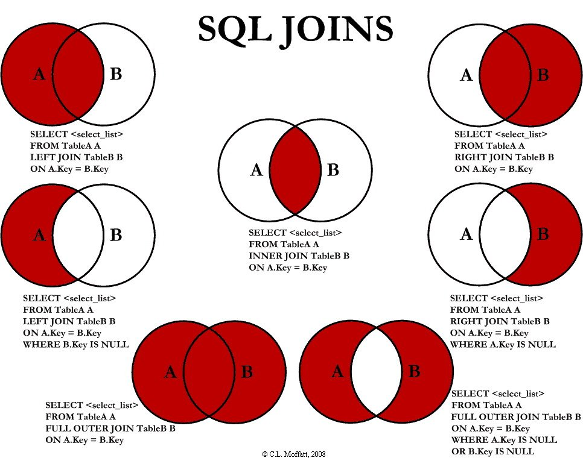

# SQL Cheat Sheet

## SQL… S-Q-L? Sequel.

SQL - Structured Query Language

A domain-specific programming language used for managing data held in relational databases management systems (RDBMs)

SQL can be used for:
* querying data (select)
* manipulating data (insert, update, delete)
* defining data (schema creation/modification)
* controlling access to data

There are several types, or flavors of SQL created by different organizations for different purposes

Most flavors of SQL operate on the same basic principles with slightly different syntax. The differences can largely be ignored when you're starting out.

## Select... From... Where...

`SELECT` - these columns  
`FROM` - this table  
`WHERE` - these critera are met  

Almost every query that extracts data from a database will have these three clauses in order to specify which data you need. They're always used in the same order.

For example

### Table:

| Year | Person | Income |
| :--- | :----- | :----- |
| 2016 | James  | 10,000 |
| 2016 | Kate   | 11,000 |
| 2016 | Sam    | 10,000 |
| 2017 | James  | 10,000 |
| 2017 | Kate   | 12,000 |
| 2017 | Sam    | 11,000 |
| 2018 | James  | 11,000 |
| 2018 | Kate   | 12,000 |
| 2018 | Sam    | 12,000 |

### Query:
```sql
SELECT year, person  
FROM income_table  
WHERE income > 11,000  
```
### Results:

| Year | Person |
| :--- | :----- |
| 2017 | Kate   |
| 2018 | Kate   |
| 2018 | Sam    |

In other words, the output of the query is the intersect of the `SELECT` and `WHERE` clauses.

## Dimensions vs Metrics

Dimensions are attributes of our data, they are not aggregated. Meanwhile metrics are quantitative measurements that are aggregated.

The `GROUP BY` clause is added to the end of a query that contains aggregation functions in order to distinguish between the dimensions and metrics in the query.

Here's an example using the same table from above.

### Query:

```sql
SELECT  person  
        , COUNT(DISTINCT year) AS years  
        , SUM(income) AS money_earned  
FROM    income_table  
WHERE   year > 2016  
AND     income > 10,000  
GROUP BY person
```

### Results:

| person | years | money_earned |
| :----- | :---- | :----------- |
| Kate   | 3     | 35,000       |
| Sam    | 2     | 23,000       |
| James  | 1     | 11,000       |

## Aggregation Functions

Aggregation functions create metrics by performing a quantitative operation on a column. In the example above, we add the income earned by each person for the years they earned over $10,000.

Some commonly used aggregation functions are:
* `COUNT()`
* `SUM()`
* `AVG()`
* `MAX()`
* `MIN()`

The COUNT function can accept a variety of parameters that modify the way it operates.
* `COUNT(*)` - counts the number of rows in the table
* `COUNT(DISTINCT <column_name>)` - counts the number of unique values in a column
* `COUNT(<column_name>)` - counts the number of rows in a column where there is a non-NULL value

## Additional Useful Syntax

`IN` - enables the specification of multiple values to satisfy a criterion in a **WHERE** clause.  
`LIMIT XX` - limits the number of rows returned by a query to the first XX number of rows in the result set.  
`ORDER BY <column_name> ASC|DESC` - sorts the output by one or more of the columns in the resulting table (defaults to ASC)  

## SQL Joins

Joins are used to pull data from multiple tables into one, combined, output. They match rows from the tables based on one or more related columns, or keys.

Slight modifications allow joins to be used to match data based on several methodologies.

It's important to consider which type of join correctly represents the data you're trying to pull. Incorrectly joining data can result in the wrong data being pulled.

A `VLOOKUP` is the equivalent of a `LEFT JOIN` in Excel.

Note:
* `LEFT JOIN` = `LEFT OUTER JOIN`
* `RIGHT JOIN` = `LEFT OUTER RIGHT`
* `INNER JOIN` = `JOIN`


